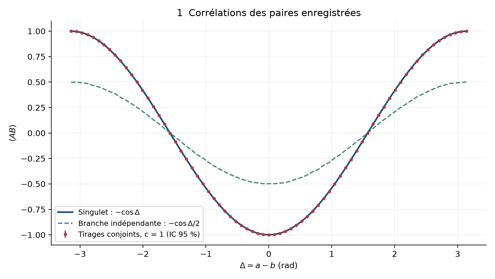
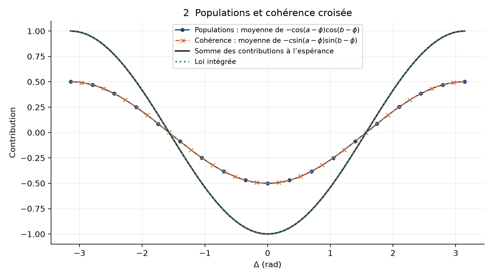
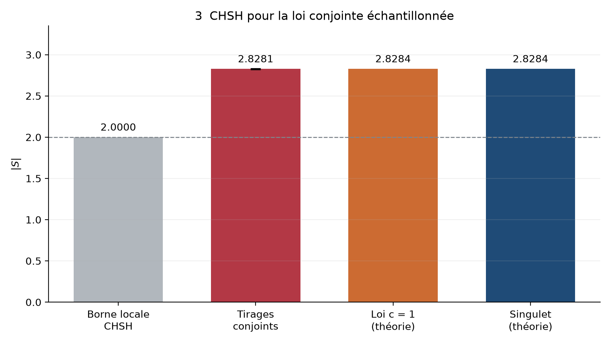
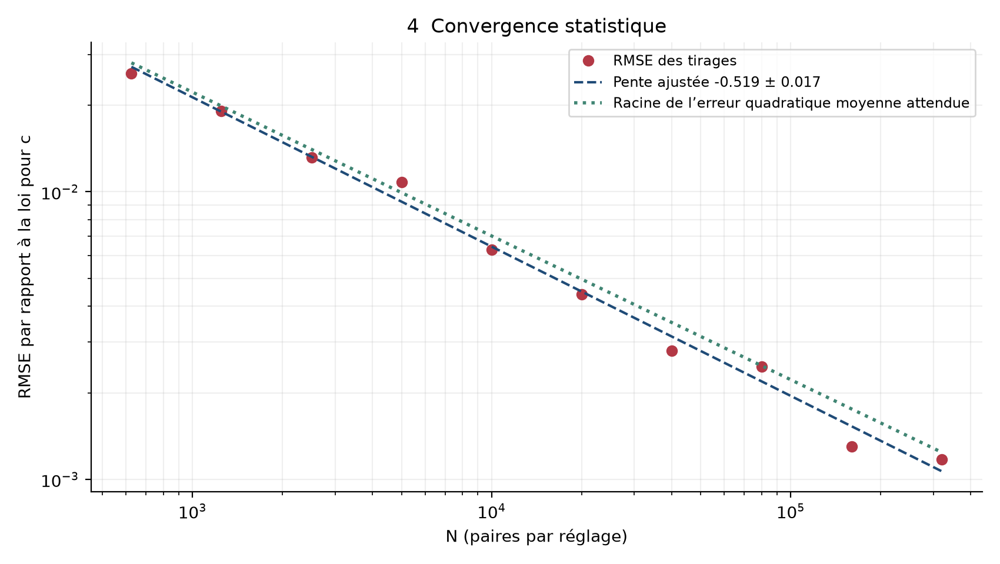
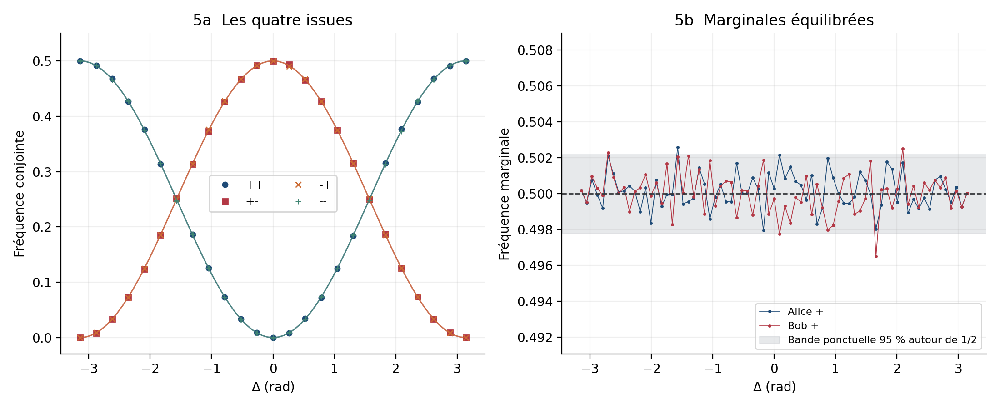
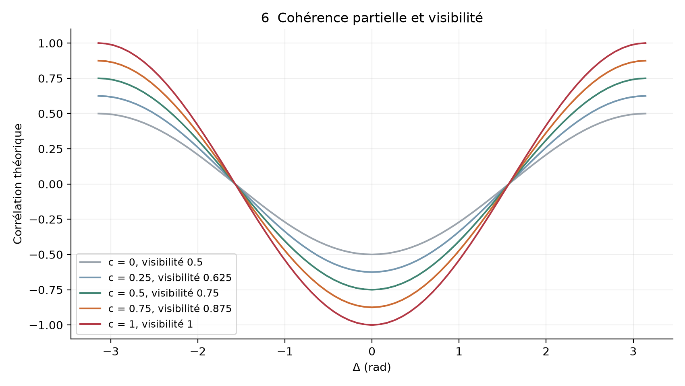
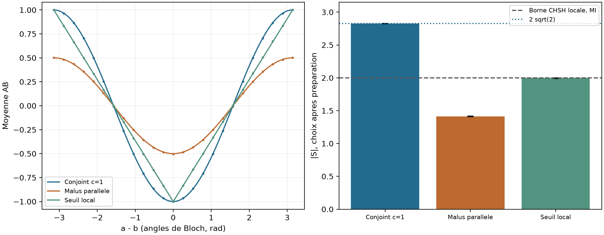

# Cohérence de paire et corrélations de Bell

Version 2.1 de Bell Indistinguishability

17 septembre 2026

## Résumé

Nous étudions le passage d'une corrélation planaire de mélange, −cos(a−b)/2, à celle du singulet, −cos(a−b), en distinguant les populations de deux configurations de paire et leur cohérence croisée. Le facteur deux apparaît lorsque la moyenne de la contribution d'interférence égale celle des populations. Il ne provient pas d'une multiplication du nombre d'événements. Nous construisons une famille de probabilités conjointes positives, normalisées, à marginales équilibrées, contrôlée par une cohérence c comprise entre 0 et 1.

$$
E_c(a,b)=-\frac{1+c}{2}\cos(a-b).
$$

La simulation Bell 45 v2 génère un couple de signes par essai selon cette loi, puis calcule la corrélation usuelle à partir des produits enregistrés. Avec c = 1 et 200 000 paires par réglage, elle donne |S| = 2,82809 ± 0,00316, compatible avec 2√2. Un calcul indépendant par matrices de densité vérifie la construction. Un exemple de champs classiques montre également comment une structure de cohérence peut contenir la même dépendance angulaire dans une corrélation d'intensité connectée.

Ces résultats identifient la contribution mathématique à expliquer dans une éventuelle dynamique onde-particule. L'échantillonnage numérique utilise explicitement les deux réglages ; il ne constitue pas une dérivation de cette loi à partir de deux détecteurs locaux autonomes. La loi étudiée est une représentation des statistiques quantiques de la famille choisie, et non une nouvelle prédiction expérimentale du singulet.

## 1 Origine de la question

Le premier texte proposait d'associer à une paire deux branches d'assignation, gd et dg, puis d'ajouter leurs corrélations. Cette approche était motivée par un écart régulier d'un facteur deux entre le modèle de branche et la cible quantique. La présente version conserve cette question, mais distingue une somme de scores de branche d'une interférence entre configurations.

La propriété recherchée appartient à la paire : deux préparations peuvent présenter exactement les mêmes statistiques sur chacun de leurs membres et des statistiques conjointes différentes. Le mélange de deux spins opposés et le singulet en fournissent un exemple. Une expérience de tomographie distingue ces états par leurs éléments de cohérence [3].

Les angles a, b et φ sont des angles de Bloch dans un même plan. Dans une expérience de polarisation linéaire, les angles de Bloch sont doubles des angles physiques des polariseurs. Les signes A et B prennent exclusivement les valeurs +1 et −1.

<!-- page -->

## 2 Branches populations et facteur deux

### 2.1 La contribution déjà présente dans le modèle

Dans Bell 45 original, une orientation φ est uniforme sur un cercle. Les probabilités locales de type cos² donnent une moyenne cos(a−φ) chez Alice et −cos(b−φ) chez Bob pour la branche opposée. Le produit des moyennes conditionnelles donne :

$$
E_{\mathrm{pop}}(a,b\mid\phi)=-\cos(a-\phi)\cos(b-\phi).
$$

Le mélange à poids égaux des configurations (+φ,−φ) et (−φ,+φ) possède cette même corrélation. La symétrisation équilibre aussi les marginales à φ fixé. L'intégration sur l'orientation fournit :

$$
\overline{E}_{\mathrm{pop}}=-\int_{-\pi}^{\pi}\frac{d\phi}{2\pi}\cos(a-\phi)\cos(b-\phi)
=-\frac{1}{2}\cos(a-b).
$$

La seconde assignation, considérée comme alternative exclusive et mélangée avec son poids, ne change pas ce résultat. C'est la relation cohérente entre les configurations que nous ajoutons dans la v2.

### 2.2 Une contribution croisée

Pour une issue donnée, notons u et v les amplitudes associées aux deux configurations. Un mélange incohérent et une superposition antisymétrique ont respectivement pour probabilités :

$$
P_{\mathrm{mix}}=\frac{|u|^2+|v|^2}{2},
\qquad
P_{\mathrm{coh}}=\frac{|u-v|^2}{2}
=P_{\mathrm{mix}}-\mathrm{Re}(uv^*).
$$

Le terme croisé est signé. Il redistribue les probabilités entre issues, sans ajouter un deuxième événement à la paire détectée. Pour les projections de spin dans le plan, sa contribution à la corrélation est :

$$
E_{\mathrm{crois}}(a,b\mid\phi)=-c\sin(a-\phi)\sin(b-\phi).
$$

À c = 1, les deux contributions s'additionnent en −cos(a−b), pour chaque φ. Après moyenne uniforme, la contribution croisée vaut elle aussi −cos(a−b)/2. La visibilité doublée résulte donc de deux contributions égales à l'espérance.

Cette égalité est propre à la géométrie étudiée. Un mélange de directions uniformes sur la sphère donne une contribution de populations −a·b/3. Le nombre 2 ne caractérise pas toutes les différences possibles entre corrélations classiques et quantiques.

<!-- page -->

## 3 Formalisme de la cohérence de paire

Les états |+−〉 et |−+〉 désignent deux configurations physiques de la paire sur l'axe φ. Ils ne sont pas seulement deux façons de nommer les mêmes particules. Nous définissons la famille :

$$
\rho_{\phi,c}=\frac{1}{2}\left(|+-\rangle\langle+-|+|-+\rangle\langle-+|\right)
-\frac{c}{2}\left(|+-\rangle\langle-+|+|-+\rangle\langle+-|\right).
$$

Les valeurs propres sont (1+c)/2, (1−c)/2, 0 et 0. Pour 0 ≤ c ≤ 1, cet opérateur est donc un état positif, de trace un. Ses deux états réduits sont I/2. La cohérence est invisible dans toute mesure effectuée sur un seul membre.

$$
E_{\phi,c}=-\cos(a-\phi)\cos(b-\phi)-c\sin(a-\phi)\sin(b-\phi).
$$

Les probabilités conjointes à φ fixé sont [1+st Eφ,c]/4. Après moyenne uniforme sur φ :

$$
P_c(s,t\mid a,b)=\frac{1}{4}\left[1-st\,\frac{1+c}{2}\cos(a-b)\right],
\qquad s,t\in\{-1,+1\}.
$$

Elles somment à un, restent positives et donnent des marginales égales à 1/2. À réglages alignés, la transition s'écrit :

| Cohérence c | P++ | P+− | P−+ | P−− | E |
|---|---|---|---|---|---|
| 0 | 1/8 | 3/8 | 3/8 | 1/8 | −1/2 |
| 1/2 | 1/16 | 7/16 | 7/16 | 1/16 | −3/4 |
| 1 | 0 | 1/2 | 1/2 | 0 | −1 |

### 3.1 Le sens d'une cohérence partielle

Le fait d'être intriqué est une propriété oui/non de l'état, mais le degré d'intrication n'est pas limité à deux valeurs. Dans cette famille, c = 0 est séparable, tandis que tout c > 0 est intriqué ; la concurrence vaut c, selon la définition de Wootters [4]. Cela reste vrai après la moyenne planaire choisie ici.

Une réalisation de c consiste à faire fluctuer la phase relative χ de la superposition, avec une moyenne réelle ⟨exp(iχ)⟩ = c. Une phase fixe χ = 0 donne c = 1 ; une phase uniformément brouillée donne c = 0. Le même état peut aussi s'écrire c fois le singulet plus (1−c) fois le mélange incohérent. Cette décomposition ne prouve pas que chaque essai appartient physiquement à l'une de ces deux catégories.

Le programme utilise c = 1 par défaut. Les autres valeurs servent à explorer la dégradation de la cohérence ; elles ne signifient pas qu'une interaction a eu lieu « à moitié ».

<!-- page -->

## 4 Des probabilités aux événements enregistrés

L'équilibre 50/50 décrit chaque liste de résultats. Il ne détermine pas leur appariement : deux listes équilibrées peuvent être corrélées, indépendantes ou anticorrélées. Pour des signes à marginales équilibrées, la distribution conjointe est entièrement déterminée par E. Il n'existe pas de paramètre supplémentaire caché dans ses quatre cases.

La simulation prépare φ, un signe équitable R et un uniforme U sans recevoir de réglage. Les angles peuvent ensuite être choisis indépendamment. La réponse utilise la loi conditionnelle à φ :

1. Poser A = R, le signe préparé avec probabilité 1/2.
2. Calculer Eφ,c avec les deux réglages a et b.
3. Poser B = A si U < (1+Eφ,c)/2 ; sinon poser B = −A.
4. Enregistrer une seule fois A, B et le produit AB.

Cet ordre est une méthode d'échantillonnage conjoint. Il n'attribue pas une direction causale physique entre les deux détecteurs. Le calcul de l'accord utilise a et b ; il n'est pas une implémentation de deux fonctions de réponse locales indépendantes.

$$
\widehat E=\frac{N_{++}+N_{--}-N_{+-}-N_{-+}}{N}.
$$

Aucune paire n'est rejetée et aucun poids n'est ajouté. Les marginales sont 50/50 en probabilité ; leurs fréquences sur un échantillon fini fluctuent normalement autour de 1/2. Le programme n'impose pas artificiellement un nombre exactement égal de signes.

### 4.1 Ce qui change par rapport à la première version

La v1 ajoutait deux scores de branche. La v2 calcule les contributions de populations et de cohérence pour définir la probabilité de la paire, puis utilise le comptage habituel sur les signes effectivement tirés. Elle ne modifie pas rétrospectivement la fréquence d'une paire déjà enregistrée.

### 4.2 Résultats de la simulation de référence

Paramètres : c = 1 ; graine 20260916 ; 200 000 paires par réglage ; 73 valeurs de Δ entre −π et π. Pour CHSH [1, 2], a = 0, a′ = π/2, b = π/4 et b′ = −π/4.

| Quantité | Résultat |
|---|---|
| Corrélations E00 E01 E10 E11 | −0,70821 ; −0,70548 ; −0,70694 ; +0,70746 |
| Valeur absolue de S | 2,82809 ± 0,00316 |
| Cible 2√2 | 2,82843 |
| RMSE de la courbe par rapport à la loi | 0,001365 |
| Pente log RMSE contre log N | −0,5192 ± 0,0170 |
| Écart marginal maximal sur la grille | 0,00349 |

<!-- page -->

## 4.3 Préparation, choix et dépendances PI/OI

La fonction prepare_source prépare les variables (φ, R, U). respond_joint reçoit ensuite les angles et cet état. sample_joint_pairs conserve une interface compacte équivalente. Aucune équation de mouvement, mémoire d'onde ou dynamique de détecteur ne produit ici la probabilité d'accord : elle est prescrite par la loi cible. Dans l'ancienne interface, tirer φ après réception des angles n'induisait pas à lui seul une dépendance statistique : sa distribution uniforme ne dépendait pas de leurs valeurs.

À description cachée fixée, l'indépendance des paramètres (PI) exige que la marginale conditionnelle d'un côté ne dépende pas du réglage de l'autre. L'indépendance des résultats (OI) exige que connaître l'autre résultat n'ajoute pas d'information une fois les deux réglages et λ fixés. Leur conjonction équivaut à la factorisation [11].

Avec λ = φ et e = Eφ,c, le noyau conjoint est :

$$
P(s,t\mid a,b,\phi)=\frac{1+st e}{4},\qquad P_A(s\mid a,b,\phi)=P_B(t\mid a,b,\phi)=\frac{1}{2}.
$$

PI est satisfaite des deux côtés. OI échoue lorsque e est non nul : conditionner sur A change la probabilité de B. Avec la description enrichie λ = (φ, R), A est déjà déterminé et :

$$
A=R,\qquad P(B=t\mid a,b,\phi,R)=\frac{1+Rt E_{\phi,c}(a,b)}{2}.
$$

OI est alors satisfaite, mais PI échoue chez Bob : la probabilité dépend de a. Inclure aussi U rend les deux réponses déterministes ; le seuil U < (1+e)/2 conserve cette dépendance. Remplacer ce seuil par le seul signe de e ne reproduirait pas les fréquences intermédiaires.

| Description cachée du même sampler | PI Alice / Bob | OI |
|---|---|---|
| φ ; R et U moyennés | oui / oui | non en général |
| φ, R ; U moyenné | oui / non | oui |
| φ, R, U | oui / non | oui |

Ces représentations donnent les mêmes fréquences observables. Le diagnostic PI/OI dépend donc du niveau de description. Il ne s'agit pas d'une identité générale entre PI et OI : à λ fixé, ce sont deux conditions distinctes. Même le statut de la factorisation peut changer quand λ change ; deux copies d'un signe classique sont dépendantes sans ce signe dans λ, mais déterministes et factorisables conditionnellement à lui.

Ce qui reste une identité est « PI et OI équivalent à la factorisation », pour chaque description donnée. Dans notre sampler, toutes les représentations ci-dessus restent non factorisables. Les choix peuvent être statistiquement indépendants de la source, les marginales rester 50/50, et une dépendance conditionnelle de B envers a subsister.

<!-- page -->

## 5 Courbe angulaire et décomposition

*Figure 1. Moyennes des produits AB réellement enregistrés, à c = 1. La référence de branche conserve les tirages indépendants du code initial. Les barres représentent des intervalles normaux ponctuels à 95 %.*

*Figure 2. Contributions à l'espérance. À c = 1, les deux demi-amplitudes se superposent presque après intégration numérique. Leur somme est une espérance de paire, et non la somme de deux clics par essai.*

<!-- page -->

## 6 CHSH et convergence

*Figure 3. CHSH calculé sur quatre échantillons distincts. L'incertitude du tableau est à un écart-type ; la barre d'erreur du graphique représente 1,96 écart-type. La barre grise est une borne de référence. Le générateur conjoint satisfait la loi du singulet à c = 1.*

*Figure 4. Convergence de 625 à 320 000 paires par réglage. La référence est la racine de la moyenne de (1−E²)/N sur la grille. L'erreur décroît comme N à la puissance −1/2. L'incertitude de pente est celle de la régression, pas une incertitude systématique.*

<!-- page -->

## 7 Probabilités marginales et contrôle de cohérence

*Figure 5. Les quatre fréquences conjointes suivent la loi normalisée tandis que les deux marginales fluctuent autour de 1/2. Les courbes ++ et −−, ainsi que +− et −+, se superposent théoriquement. La bande grise est ponctuelle ; ce n'est pas une bande simultanée couvrant toute la grille.*

*Figure 6. Famille analytique de visibilité V = (1+c)/2. Ces courbes ne sont pas cinq expériences supplémentaires. Un contrôle numérique distinct à c = 1/2 et 20 000 paires par réglage donne |S| = 2,1204 ± 0,0120, contre 2,1213 attendu.*

La comparaison des deux extrêmes suffit à la question initiale. Les valeurs intermédiaires permettent de tester séparément la contribution croisée et de distinguer perte de cohérence, bruit de détection et changement de préparation.

<!-- page -->

## 8 Analogies classiques

### 8.1 Interférence de deux amplitudes

Deux champs classiques cohérents présentent un terme croisé dans l'intensité de leur somme. Une moyenne de phase peut supprimer ce terme sans supprimer les intensités moyennes de chaque contribution. Cette analogie porte directement sur le calcul populations plus cohérence.

Pour l'appliquer à une paire séparée, il faut identifier les deux configurations physiques, leur phase relative et l'observable de champ correspondante. Des expériences de cohérence classique utilisant la polarisation et la parité spatiale d'un même faisceau rendent une structure non séparable observable [6]. Les deux degrés de liberté y appartiennent au même faisceau ; leur lecture ne réalise pas automatiquement deux détections distantes de particules.

### 8.2 Champs aléatoires et intensités connectées

Considérons un vecteur complexe gaussien circulaire z à deux composantes, de covariance identité. Une source fournit EA = z et EB = Jz*, où J échange les composantes avec un signe opposé. Chaque analyseur projette son champ sur deux canaux et mesure une intensité. Le calcul des moments gaussiens donne :

$$
G_{st}=\langle I_s^A I_t^B\rangle
=1+\frac{1-st\cos(a-b)}{2}.
$$

Les intensités moyennes valent un. La corrélation connectée, obtenue en soustrayant leur produit, est :

$$
C_{st}=G_{st}-\langle I_s^A\rangle\langle I_t^B\rangle
=\frac{1-st\cos(a-b)}{2}.
$$

Normaliser C par sa somme restitue la table du singulet. Normaliser G par sa somme donne une corrélation −cos(a−b)/3. La structure angulaire complète existe donc dans une cohérence classique, mais deux observables différentes sont comparées.

Cette prescription de source n'est pas annoncée comme un montage optique passif. Une simulation de 600 000 réalisations confirme les deux formules. Pour a−b = −0,82, les corrélations complète et connectée valent respectivement −0,22754 et −0,68130, contre −0,22741 et −0,68222 attendus.

### 8.3 La relation de Siegert

Pour un champ gaussien circulaire centré, dans les conditions usuelles de cohérence scalaire, la relation de Siegert relie les corrélations d'intensité et de champ :

$$
g^{(2)}(\tau)=1+\left|g^{(1)}(\tau)\right|^2.
$$

Le maximum 2 de la corrélation d'intensité normalisée comporte un fond et une contribution cohérente [5]. C'est un exemple physique de renforcement corrélationnel ; ce facteur deux n'est pas, à lui seul, celui d'un produit binaire AB.

<!-- page -->

## 8.4 Deux polariseurs en parallèle

Deux faisceaux préparés ensemble arrivent chacun sur un analyseur à deux sorties. Les angles physiques sont α et β ; les angles de Bloch sont a = 2α et b = 2β. On conserve les deux sorties de chaque analyseur, sans sélectionner seulement les transmissions. Une source fournit les polarisations θ et θ+π/2, avec θ uniforme. Les deux champs peuvent avoir une phase relative fixe : aucune incohérence optique n'est nécessaire au calcul qui suit.

Les fractions d'intensité dans la sortie + obéissent à Malus. Pour produire un signe par côté, nous posons explicitement une règle de routage proportionnelle à ces intensités, avec des uniformes locaux indépendants conditionnellement à la source :

$$
P(A=+1\mid\alpha,\theta)=\cos^2(\alpha-\theta),\qquad
P(B=+1\mid\beta,\theta)=\sin^2(\beta-\theta).
$$

La phase optique commune disparaît du carré du module de chaque projection. Sa stabilité ne crée donc pas le terme croisé entre configurations de paire utilisé en section 3. Le paramètre c de cette section ne mesure pas simplement la cohérence optique entre deux faisceaux séparés.

$$
E_{\mathrm{par}}(\alpha,\beta)
=-\int_0^\pi\frac{d\theta}{\pi}\cos(2\alpha-2\theta)\cos(2\beta-2\theta)
=-\frac{1}{2}\cos\left(2(\alpha-\beta)\right).
$$

Des polarisations identiques donnent le signe opposé. Pour les polarisations orthogonales retenues ici, changer β peut changer B, donc AB, sans changer A. Ce comportement est entièrement local et produit déjà une corrélation dépendant de la différence des angles. Il donne une demi-amplitude dans ce modèle précis.

Deux intensités continues ne sont pas spontanément deux événements binaires. Le résultat précédent utilise la règle de détection indiquée ; d'autres règles donnent d'autres courbes. À titre de contrôle, une réponse déterministe au signe de cos(a−φ), avec le signe opposé chez Bob, donne une corrélation triangulaire :

$$
E_{\mathrm{seuil}}(a,b)=-1+\frac{2|a-b|}{\pi},\qquad |a-b|\leq\pi.
$$

Cette règle à seuil n'est pas la loi de Malus. Elle atteint |S| = 2 pour les angles CHSH retenus. Le facteur 1/2 n'est donc pas une limite universelle des corrélations classiques ; il caractérise la source et les réponses de Malus choisies.

Le fait qu'un produit change lorsqu'un seul de ses facteurs change n'implique aucune influence à distance. Il n'établit pas davantage que toutes les fréquences du singulet sont réalisées : l'amplitude et les probabilités conjointes doivent encore être calculées.

<!-- page -->

## 8.5 Contrôle numérique après préparation

Le script audit_locality.py prépare tous les aléas avant de choisir, pour chaque essai, les deux réglages avec un générateur distinct. Il enregistre un million d'essais sans rejet. Les angles de Bloch sont les mêmes qu'en section 4.2. Les deux réponses de Malus ont des interfaces séparées : chacune reçoit seulement son angle et ses variables préparées.

*Figure 7. Lois analytiques et moyennes numériques ; à droite, CHSH calculé après des choix aléatoires postérieurs à la préparation. Les barres indiquent 1,96 écart-type. Les points des courbes réutilisent une population préparée de 80 000 essais et ne sont donc pas indépendants entre angles.*

| Modèle | S observé (1 écart-type) | S théorique |
|---|---|---|
| Générateur conjoint, c = 1 | 2,82627 ± 0,00283 | 2,82843 |
| Polariseurs parallèles, Malus | 1,41411 ± 0,00374 | 1,41421 |
| Réponses locales à seuil | 1,99841 ± 0,00347 | 2 |

Un second contrôle réutilise exactement les mêmes états préparés, y compris les aléas des détecteurs. À b = 0, remplacer a = 0 par a = π inverse tous les signes B du générateur conjoint à c = 1 ; il n'en modifie aucun dans les deux modèles parallèles. Remplacer b à a fixé ne modifie aucun signe A, dans les trois modèles. Les marginales moyennées ne révèlent pas nécessairement ces dépendances conditionnelles.

Le générateur conjoint est donc compatible avec une préparation antérieure aux choix, mais sa réponse reste contextuelle aux deux réglages. La chronologie des tirages ne le transforme pas en dynamique de deux faisceaux séparés.

<!-- page -->

## 9 Indiscernabilité comptage et mémoire

### 9.1 Symétrie échange et information de branche

Les effets d'échange en mécanique quantique concernent des amplitudes symétrisées ou antisymétrisées. L'ignorance d'une étiquette n'ajoute pas automatiquement un terme d'interférence. Pour la famille présente, il faut une cohérence entre les deux configurations pertinentes ; une information de branche conservée dans l'environnement peut réduire cette cohérence.

L'article de Cássio Sozinho Amorim examine le lien entre indistinguabilité informationnelle et contraintes de non-localité [10]. Cette référence soutient l'intérêt de la question structurelle.

### 9.2 Synchronisation et mémoire dans les gouttelettes

Papatryfonos et collègues obtiennent un dépassement statique d'une expression de Bell dans un système de gouttelettes couplées par des ondes [7]. Les réglages géométriques participent à la dynamique commune. Ces résultats motivent l'étude d'une mémoire physique capable de porter des corrélations.

La prépublication de López et collègues étudie ensuite la persistance de corrélations après découplage, dans un modèle réduit de type Lorenz [8]. Les mesures finales sont associées à des préparations différentes, et les auteurs identifient une dépendance de la distribution du champ aux configurations. Leur résultat donne un mécanisme de synchronisation durable ; il n'identifie pas le paramètre c construit ici à une variable mesurée de leur modèle.

Le rapprochement proposé est un programme de recherche : déterminer si une observable du champ ou de sa mémoire joue le rôle de la cohérence croisée et si elle contribue directement aux fréquences des détections.

<!-- page -->

## 10 Portée des résultats et notion de localité

### 10.1 Une information propre à la paire

Les variations de cohérence étudiées sont invisibles dans les marginales, mais visibles dans les statistiques conjointes. Cette formulation est justifiée pour notre famille. Elle ne caractérise pas à elle seule une violation de Bell : deux copies d'une pièce classique ont aussi une corrélation invisible dans chaque marginale. Le dépassement d'une borne concerne plusieurs contextes de mesure.

### 10.2 Le statut du terme c

La cohérence complète un modèle initial limité aux populations. Elle n'est pas un terme oublié dans le théorème de Bell : λ peut déjà contenir une phase, une mémoire, une synchronisation et toutes les variables communes de préparation. Ajouter c à λ n'impose pas le noyau conjoint de la section 3. Ce noyau a été construit à partir d'un état quantique, puis échantillonné ; aucune dynamique classique locale autonome ne l'a encore dérivé ici.

### 10.3 Plusieurs critères physiques à distinguer

La factorisation conditionnelle de Bell est plus exigeante que l'invariance des marginales observées ou l'absence de communication après un découplage. La critiquer comme définition générale de la localité est une discussion possible ; l'appeler superflue effacerait les hypothèses qui déterminent les prédictions. Dans un modèle classique séparé, avec état causal complet, choix indépendants et réponses locales, la mémoire commune est déjà incluse dans λ. Une factorisation peut échouer si l'on en moyenne une partie ou si le protocole introduit un autre lien causal.

### 10.4 Ce que signifie la borne de Tsirelson

La valeur 2√2 borne CHSH dans le formalisme quantique bipartite usuel [12]. Une valeur numérique identique obtenue dans une analogie classique ne démontre pas un mécanisme non local, ni une limite classique générale. La prépublication [8] rapporte notamment S proche de 3,15 en régime statique, au-dessus de 2√2 : elle ne peut donc justifier cette valeur comme plafond universel des systèmes synchronisés. La borne |S| ≤ 2 reste celle des modèles factorisables avec choix indépendants ; elle n'est pas une borne de tous les protocoles classiques imaginables.

### 10.5 Une question physique toujours ouverte

Le théorème ne clôt pas toutes les questions sur une description sous-jacente de la physique quantique. Les gouttelettes constituent des mécanismes classiques explicites de corrélation et une piste pour étudier la mémoire. Les résultats cités et notre sampler n'établissent toutefois pas un mécanisme local reproduisant l'ensemble des tests de Bell avec choix indépendants. Une proposition plus forte doit préciser sa dynamique, ses dépendances et le protocole expérimental auquel elle s'applique. C'est dans ce sens défini que le programme reste ouvert.

<!-- page -->

## 11 Prédictions et prolongements

### 11.1 Une perturbation discriminante

Une première expérience numérique consisterait à perturber la phase relative ou une variable de mémoire tout en contrôlant que les distributions individuelles restent identiques. Dans la famille de référence, la visibilité V et la cohérence c sont reliées par :

$$
V=\frac{1+c}{2},
\qquad
P(A=B\mid a=b)=\frac{1-c}{4}.
$$

Cette loi n'est une prédiction du modèle physique futur que si c y est défini et mesuré indépendamment des corrélations que l'on cherche à expliquer. Déduire c de V puis retrouver V avec la formule ne constituerait pas un test.

### 11.2 Une mesure hors du plan

La moyenne planaire de la famille possède le tenseur de corrélation suivant, dans les axes x, y et z :

$$
T=\mathrm{diag}\left(-\frac{1+c}{2},-c,-\frac{1+c}{2}\right).
$$

Une mesure sur l'axe y donne donc Tyy = 1−2V. Une famille isotrope de type Werner aurait au contraire −V sur les trois axes. Deux modèles présentant la même courbe dans un plan peuvent ainsi être distingués par une mesure supplémentaire. À c = 1, l'état redevient le singulet isotrope.

### 11.3 Plusieurs particules

Nous ne conservons pas l'extrapolation factorielle N! de la première version. Pour plusieurs configurations, le carré du module d'une somme d'amplitudes contient des populations et des termes croisés dont les signes, les phases et la normalisation doivent être calculés. Leur nombre ne donne pas directement un facteur multiplicatif pour une corrélation normalisée.

Une extension à trois systèmes devrait partir d'un état ou d'une dynamique explicitement définis, calculer toutes les issues, puis seulement former l'observable multipartite appropriée. La présente v2 ne prédit pas les statistiques GHZ ou Mermin.

## 12 Conclusion

Le facteur deux du modèle planaire reçoit une décomposition exacte : une contribution de populations à demi-amplitude et une contribution de cohérence de même amplitude. La cohérence redistribue les probabilités conjointes tout en laissant les marginales invariantes.

Bell 45 v2 confirme que la loi ainsi définie produit les fréquences attendues lorsqu'on échantillonne réellement un couple de signes par essai. Le comptage expérimental ordinaire est conservé. La dynamique physique reste une question distincte : il faut établir quelles variables du champ portent la cohérence et comment les interactions avec les détecteurs convertissent cette structure en événements.

Le contrôle avec polariseurs parallèles confirme qu'une corrélation peut varier sans changement de l'autre résultat ; il ne fournit pas la contribution manquante du singulet. L'intérêt de cette reformulation est de rendre cette question calculable.

<!-- page -->

## Références

[1] J. S. Bell. On the Einstein Podolsky Rosen paradox. Physics Physique Fizika 1, 195–200 (1964). [Article original](https://doi.org/10.1103/PhysicsPhysiqueFizika.1.195).

[2] J. F. Clauser, M. A. Horne, A. Shimony et R. A. Holt. Proposed Experiment to Test Local Hidden-Variable Theories. Physical Review Letters 23, 880–884 (1969). [Formulation CHSH](https://doi.org/10.1103/PhysRevLett.23.880).

[3] S. Virzí et collègues. Optimal estimation of entanglement and discord in two-qubit states. Scientific Reports 9, 3030 (2019). [Article et prépublication](https://arxiv.org/abs/1810.09331).

[4] W. K. Wootters. Entanglement of Formation of an Arbitrary State of Two Qubits. Physical Review Letters 80, 2245–2248 (1998). [Concurrence et intrication](https://arxiv.org/abs/quant-ph/9709029).

[5] D. Ferreira, R. Bachelard, W. Guerin, R. Kaiser et M. Fouché. Connecting field and intensity correlations: the Siegert relation and how to test it (2020). [Texte et lien vers la publication](https://arxiv.org/abs/2002.05425).

[6] K. H. Kagalwala, G. Di Giuseppe, A. F. Abouraddy et B. E. A. Saleh. Bell's measure in classical optical coherence. Nature Photonics 7, 72–78 (2013). [Notice des auteurs et DOI](https://pubblicazioni.unicam.it/handle/11581/256381).

[7] K. Papatryfonos et collègues. Static Bell test in pilot-wave hydrodynamics. Physical Review Fluids 9, 084001 (2024). [Texte intégral](https://thales.mit.edu/bush/wp-content/uploads/2024/08/Bell1-PRF-2024.pdf).

[8] Á. G. López, R. N. Valani, Y. Li et J. W. M. Bush. Synchronization induces Bell violations in a model of walking droplets. arXiv:2608.21915v1, 22 août 2026. Prépublication. [Texte intégral](https://arxiv.org/html/2608.21915v1).

[9] S. Saunders. The Gibbs Paradox. Entropy 20, 552 (2018). [Analyse du paradoxe et de la distinguabilité](https://www.mdpi.com/1099-4300/20/8/552).

[10] C. S. Amorim. Indistinguishability as nonlocality constraint. Scientific Reports 8, 6091 (2018). [Article](https://www.nature.com/articles/s41598-018-24489-7).

[11] T. Norsen. Local Causality and Completeness: Bell vs. Jarrett. Foundations of Physics 39, 273 (2009). Analyse critique de la lecture causale de PI/OI. [Article](https://arxiv.org/abs/0808.2178).

[12] B. S. Cirel'son (Tsirelson). Quantum generalizations of Bell's inequality. Letters in Mathematical Physics 4, 93–100 (1980). [Article original](https://doi.org/10.1007/BF00417500).

<!-- page -->

## Reproductibilité

La simulation utilise Python, NumPy et Matplotlib. Aucun module SciPy n'est requis. Exécution de référence depuis la racine du projet :

~~~text
python code/Bell_test_45.py --coherence 1 --no-show
python code/test_bell45_v2.py
python code/test_locality.py
python code/audit_locality.py
python code/build_bell_v2_paper.py
~~~

Le dossier code/resultats_bell45_v2 contient les six figures, les tableaux courbes.csv et convergence.csv, les effectifs complets CHSH dans resultats.json et un extrait du journal de 1 000 essais par contexte. Le JSON enregistre aussi les versions des bibliothèques, la graine et l'empreinte du script.

Les contrôles comparent les probabilités du programme à des projections de matrices de densité calculées indépendamment ; ils vérifient positivité, normalisation, marginales, comptage AB et reproductibilité. Le calcul des champs gaussiens est conservé dans code/coherence_facteur_deux.py.

Le contrôle des polariseurs utilise la graine 20260917. Son dossier code/resultats_locality conserve les effectifs par contexte, les diagnostics de dépendance, les courbes et le journal complet des choix et résultats. La version 2.1 sépare préparation et réponse sans changer la suite aléatoire de la simulation de référence.
